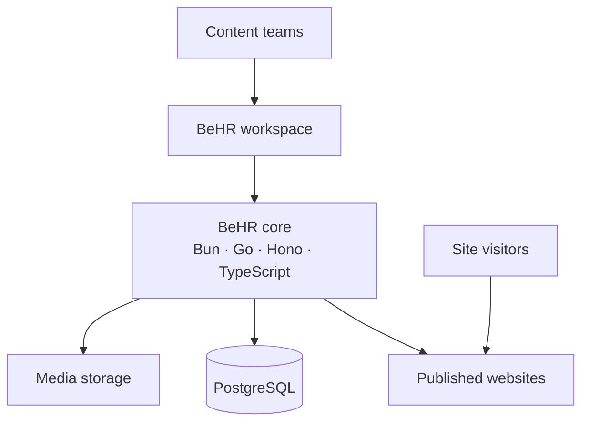

# BeHR

<strong>A Modern CMS for Multi-Site Publishing</strong>

  
  
  
  
  

BeHR is a modern content management system for creating, managing, and
publishing multiple websites from one place. It gives content teams a focused
workspace for shaping pages, organizing media, and delivering polished digital
experiences across every site they manage.

Designed for organizations that value ownership and simplicity, BeHR brings
content, design, publishing, and site management together in one cohesive
platform. Its technology foundation combines Bun, Go, Hono, TypeScript, and
PostgreSQL to deliver a fast web experience, a dependable application core,
and durable content storage.

## How BeHR Works

Explore the [project documentation](docs/) for the product vision and system
design. BeHR is available under the [BSD 3-Clause License](LICENSE).
