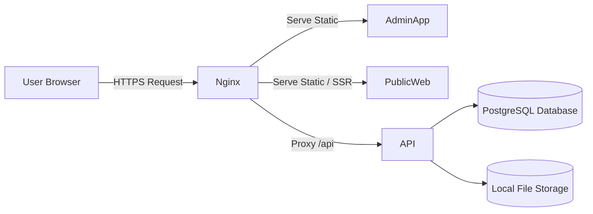
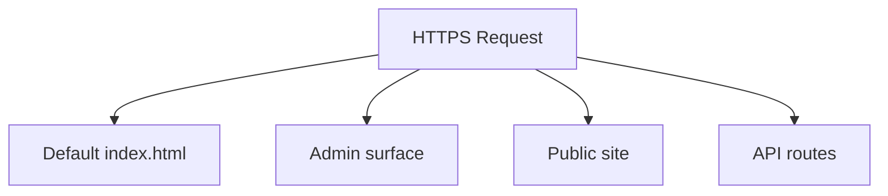
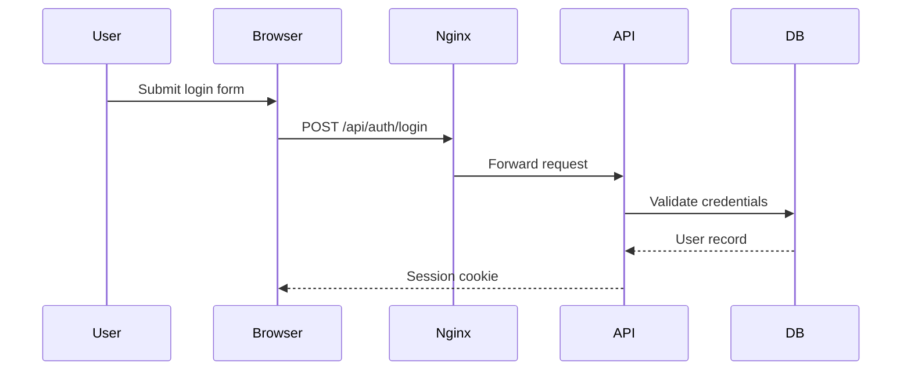
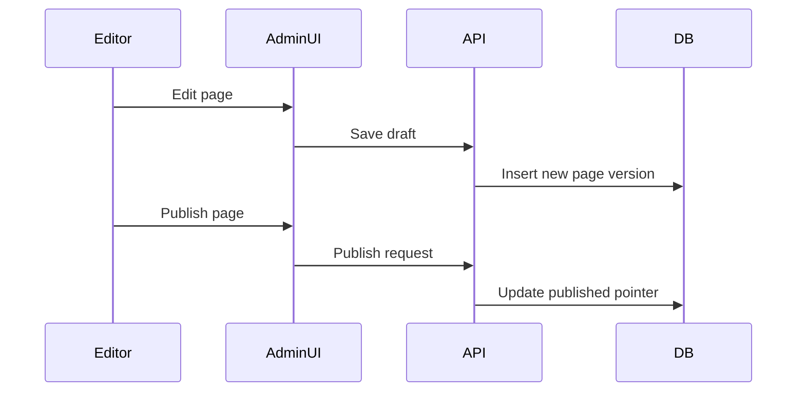

# BHeR CMS — System Architecture

Version: 1.1
Deployment Model: Single VPS
Architecture Style: Monolithic application with strict internal boundaries
Primary Stack: Bun, Hono, PostgreSQL, React, nginx

---

# 1. Architectural Overview

BHeR CMS is a multi-tenant content management system designed to operate as a single deployable unit on one VPS. The system is intentionally constrained to reduce operational complexity, minimize infrastructure dependencies, and ensure predictable behavior.

The architecture is monolithic at runtime but modular in code structure. All core functionality executes within a single backend process, backed by a single relational database and a local filesystem for asset storage.

The system is composed of three primary runtime surfaces:

* Public Website Renderer
* Admin Panel
* API Backend

All surfaces are served through a single reverse proxy entrypoint.

The architecture explicitly avoids distributed infrastructure assumptions such as:

* Kubernetes
* Message queues
* Background worker fleets
* Multi-region deployments
* Microservice decomposition

---

# 2. High-Level System Topology

The system is accessed through a single web entrypoint and routes requests to the appropriate application surface based on domain, path, and authentication context.

Phase A implements only static entry documents for the root, admin, and public web surfaces. Reverse-proxy routing, SSR, and tenant-aware public rendering are not implemented until their declared phases.

---

# 3. Root Entry Document and Major Function Paths

The root `index.html` is the default document a web server returns when a user navigates to the base URL. In Phase A it contains only a clear statement that the landing experience is not implemented. It does not contain routing logic, a customer portal, or links that imply later-phase behavior already exists.

The target request paths are:

Interpretation:

The root document is a valid deployable entry file, not a universal application router. nginx will eventually select the root, admin, public, or API surface using host and path rules in Phase Q.

Admin Panel

The Phase A app displays only an implementation-status message. Administrative workflows are added by their declared phases.

Public Website

The Phase A app displays only an implementation-status message. Domain routing and published content delivery are added in Phase H.

Customer Portal

A separate customer portal is not implemented and is not part of the current v1 execution phases. It must not receive code unless the phase plan is explicitly revised.

---

# 4. Runtime Components

## 4.1 Reverse Proxy — nginx

Responsibilities:

* TLS termination
* Host-based routing
* Static asset delivery
* API proxying
* Rate limiting for sensitive endpoints
* Request logging

The reverse proxy is the single externally exposed service.

No application service is directly internet-facing.

---

## 4.2 API Backend — Bun + Hono

This component is the authoritative runtime boundary for all business logic.

Responsibilities:

* Authentication and session handling
* Tenant resolution
* Role-based access control
* Content validation
* Page persistence and versioning
* Publish workflow execution
* Asset upload handling
* Preview token validation
* Domain routing resolution

The API backend is stateful only through the database and filesystem.

The API does not render UI components.

---

## 4.3 Admin Application — React

The admin application provides the internal CMS interface.

Responsibilities:

* Authentication UI
* Site management
* Page editing
* Asset management
* Theme configuration
* Preview and publish controls

Constraints:

* No direct database access
* No business logic authority
* All mutations occur through the API

---

## 4.4 Public Website Renderer — React

The public renderer is responsible for displaying published content for tenant sites.

Responsibilities:

* Domain-aware routing
* Published page rendering
* Theme token application
* SEO metadata generation
* Static asset referencing

Constraints:

* Cannot access draft content
* Cannot perform mutations
* Cannot bypass publish controls

---

## 4.5 PostgreSQL Database

The database is the authoritative persistence layer.

Responsibilities:

* Identity and access control data
* Tenant and site relationships
* Page metadata
* Page version storage
* Publication history
* Asset metadata
* Audit events

Content documents are stored as JSONB.

Identity and workflow relationships remain relational.

---

## 4.6 Local File Storage

The filesystem stores binary assets such as images and uploaded media.

Storage roots:

/var/lib/bhr-cms/uploads
/var/lib/bhr-cms/derivatives

Constraints:

* Paths are system-generated
* Users cannot control filesystem paths
* Files are referenced by logical storage keys

---

# 5. Request Lifecycle

The following sequence describes a typical authenticated workflow.

---

# 6. Content Publication Flow

---

# 7. Security Boundaries

The architecture enforces explicit trust boundaries.

Client Layer

Untrusted

Reverse Proxy

Network enforcement boundary

API Backend

Authority boundary

Database

Persistence boundary

Filesystem

Binary storage boundary

Security rules:

* All authentication is server-authoritative
* Tenant context is resolved server-side
* Role checks occur in API middleware
* Draft content cannot be publicly exposed
* Preview access requires token validation

---

# 8. Deployment Model

The system runs as a single logical deployment.

Recommended process layout:

nginx
Bun API service
PostgreSQL instance
Local filesystem storage

Optional separation:

PostgreSQL may be hosted externally if operationally justified.

No horizontal scaling assumptions exist in version 1.

---

# 9. Failure Domains

The system defines clear operational failure boundaries.

Reverse Proxy Failure

Requests cannot reach application services.

API Failure

Business logic becomes unavailable.

Database Failure

All persistent operations fail.

Filesystem Failure

Asset operations fail.

Each domain must be recoverable independently.

---

# 10. Observability Model

Logging and health monitoring are local-first.

Required signals:

* API health endpoint
* Database connectivity check
* Disk availability check
* Request logs
* Error logs

No external monitoring dependency is required for initial deployment.

---

# 11. Scaling Constraints

Version 1 scaling assumptions:

Single VPS

Single API process

Single database instance

Single storage root

The architecture is intentionally constrained to maintain operational simplicity.

Scaling triggers may include:

High request latency
Database saturation
Disk throughput limits
Memory pressure

Scaling responses may include:

Vertical scaling
Database isolation
Object storage migration
Read caching

Distributed architecture is not permitted in version 1.

---

# 12. Data Integrity Guarantees

The system enforces deterministic persistence behavior.

Rules:

Page versions are immutable.

Published versions are pointer-based.

Draft versions cannot overwrite published versions.

Asset references are recorded explicitly.

Audit events record critical mutations.

---

# 13. Operational Invariants

The following invariants must remain true.

The system is deployable on one VPS.

The system runs as one backend process.

All mutations pass through the API.

All content documents validate against schema.

All published content is deterministic.

All backups include both database and asset storage.

---

# 14. Future Expansion Guardrails

The following architectural constraints must not be violated without explicit redesign.

Do not introduce distributed workers.

Do not introduce message queues.

Do not introduce microservices.

Do not allow arbitrary code execution from plugins.

Do not bypass content schema validation.

Do not break backward compatibility of stored page documents.

---

End of Architecture Document
