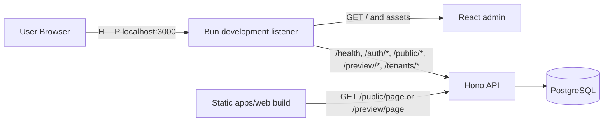
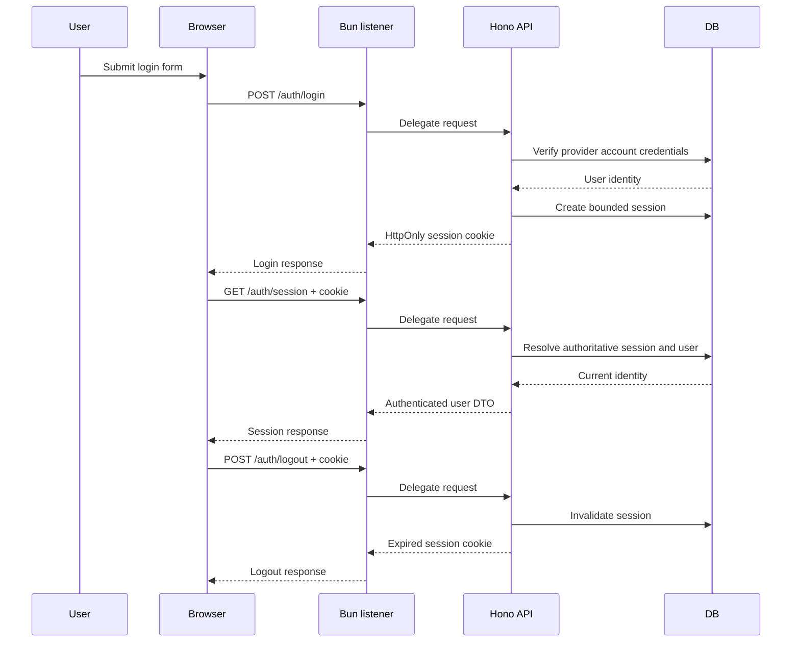
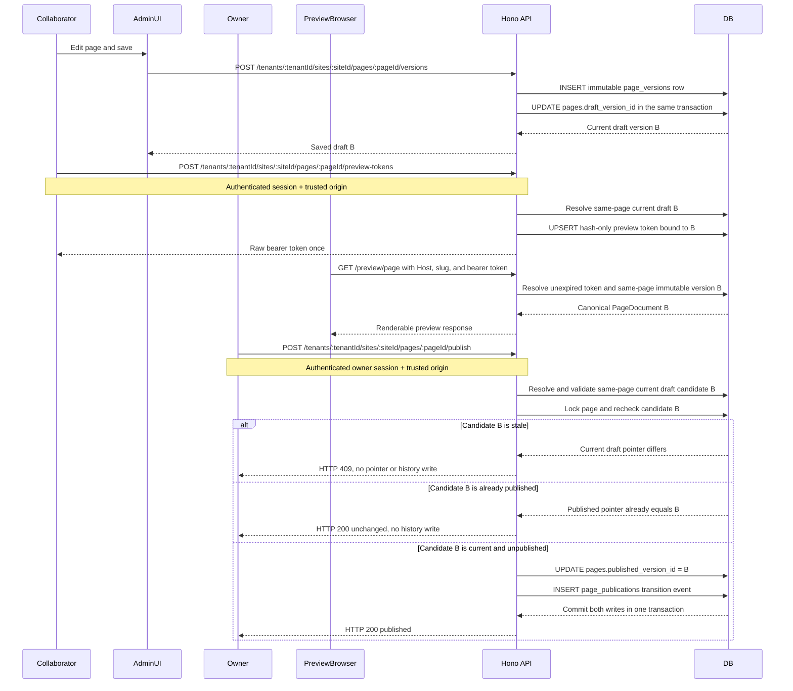

# BeHR CMS — System Architecture

Document Status: Current-state architecture; governance versions are tracked in PHASE_PLAN.md
Deployment Model: Single VPS
Architecture Style: Monolithic application with strict internal boundaries
Primary Stack: Bun, Hono, Better Auth, Drizzle, PostgreSQL, React, nginx

---

# 1. Architectural Overview

BeHR CMS is a multi-tenant content management system designed to operate as a single deployable unit on one VPS. The system is intentionally constrained to reduce operational complexity, minimize infrastructure dependencies, and ensure predictable behavior.

The architecture is monolithic at runtime but modular in code structure. All core functionality executes within a single backend process, backed by a single relational database and a local filesystem for asset storage.

The system is composed of three primary runtime surfaces:

* Public Website Renderer
* Admin Panel
* API Backend

The implemented local development workflow serves the admin and API through
one Bun listener. A single nginx entrypoint remains the Phase Q production
target; no nginx configuration is implemented yet.

The architecture explicitly avoids distributed infrastructure assumptions such as:

* Kubernetes
* Message queues
* Background worker fleets
* Multi-region deployments
* Microservice decomposition

---

# 2. High-Level System Topology

The current local entrypoint is `http://localhost:3000`. Bun serves the admin
document and its bundled assets directly, then delegates unmatched requests to
the existing Hono application.



The Phase Q production target keeps the same public route paths: nginx will
serve static application assets and forward `/health`, `/auth/*`, `/public/*`, `/preview/*`,
`/tenants`, and `/tenants/*`—including nested site routes—to the Bun API. It must not
invent an `/api` prefix unless the application routes are changed in a
separately reviewed phase. Reverse-proxy configuration and SSR remain
unimplemented; Phase H implements the public read model and static renderer
without pulling that production routing work forward.

---

# 3. Root Entry Document and Major Function Paths

The integrated development listener registers `apps/admin/index.html` at `/`.
Bun bundles the document's referenced React entry and exposes the resulting
development assets on the same origin. The fallback delegates to Hono, so an
unknown API path remains an API 404 instead of becoming admin HTML.

The target request paths are:

```mermaid
flowchart TD

    Request[HTTP request]
    Request --> Root[GET / → admin index.html]
    Request --> Health[GET /health]
    Request --> Login[POST /auth/login]
    Request --> Register[POST /auth/register]
    Request --> Session[GET /auth/session]
    Request --> Logout[POST /auth/logout]
    Request --> CreateTenant[POST /tenants]
    Request --> ListTenants[GET /tenants]
    Request --> TenantAccess[GET /tenants/:tenantId]
    Request --> CreateSite[POST /tenants/:tenantId/sites]
    Request --> ListSites[GET /tenants/:tenantId/sites]
    Request --> Members[GET/POST /tenants/:tenantId/members]
    Request --> Pages[GET/POST /tenants/:tenantId/sites/:siteId/pages]
    Request --> Draft[GET /tenants/:tenantId/sites/:siteId/pages/:pageId]
    Request --> Version[POST /tenants/:tenantId/sites/:siteId/pages/:pageId/versions]
    Request --> PublicPage[GET /public/page?slug=...]
    Request --> PreviewToken[POST /tenants/:tenantId/sites/:siteId/pages/:pageId/preview-tokens]
    Request --> PreviewPage[GET /preview/page?slug=...]
    Request --> PublishPage[POST /tenants/:tenantId/sites/:siteId/pages/:pageId/publish]
    Request --> UploadAsset[POST /tenants/:tenantId/sites/:siteId/assets]
    Request --> ListAssets[GET /tenants/:tenantId/sites/:siteId/assets]
    Request --> PublicAsset[GET /public/assets/:assetId]
    Request --> PreviewAsset[GET /preview/assets/:assetId]
```



Interpretation:

The admin document is an explicit `/` route, not a universal fallback. nginx
will eventually reproduce this public topology in Phase Q without changing the
implemented Hono route paths.

Admin Panel

The admin provides login, session restoration, logout, tenant-local site
management, and owner-only membership provisioning and invitation handling.
Phase K adds tenant/site-scoped page listing, page creation, draft loading,
structured local editing, and explicit manual draft saving.

Public Website

Phase H replaces the status placeholder with a static browser application that
translates one pathname segment to a page slug, reads `/public/page` on the
current origin, and renders the canonical document. Production hostname
routing remains Phase Q infrastructure.

Customer Portal

A separate customer portal is not implemented and is not part of the current v1 execution phases. It must not receive code unless the phase plan is explicitly revised.

---

# 4. Runtime Components

## 4.1 Reverse Proxy — nginx (Phase Q)

Responsibilities:

* TLS termination
* Host-based routing
* Static asset delivery
* API proxying
* Rate limiting for sensitive endpoints
* Request logging

These are future production responsibilities. The reverse proxy is not part of
the implemented local workflow and no production nginx configuration exists.
When Phase Q implements it, nginx will be the single externally exposed
service.

No application service is directly internet-facing.

---

## 4.2 API Backend — Bun + Hono

This component is the authoritative runtime boundary for all business logic.

Responsibilities:

* Authentication and session handling
* Tenant resolution
* Role-based access control
* Content validation
* Page persistence and versioning
* Publish workflow execution
* Asset upload handling
* Preview token validation
* Domain routing resolution

The API backend is stateful only through the database and filesystem.

The Hono application does not render UI components. The development listener
serves the imported admin document before delegating API requests to Hono.

Phase C implements authentication through Hono, Better Auth, and the existing
Bun SQL-backed Drizzle client. Phase D adds tenant creation, membership-based
listing, and path-based tenant access resolution. Phase E adds owner-authorized
site creation and membership-authorized site listing beneath that same tenant
boundary. The pre-Phase G membership work adds owner-only member listing and
provisioning plus invite-gated identity registration. Phase G adds relationally
scoped page metadata, immutable draft versions, and current-draft resolution.
Phase H adds nullable published read state, hostname/slug resolution, and the
public canonical-document response. Authenticated decisions use the user
resolved from the authoritative database session; the public read is
unauthenticated and read-only. Phase I adds authenticated preview credential
issuance and unauthenticated bearer preview reads bound to immutable draft
snapshots. Phase J adds owner-only publication of the current immutable draft
and append-only transition history. Phase L adds authenticated site-scoped
original-file upload with bounded multipart parsing, server-generated storage
keys, exclusive filesystem writes, and revalidated metadata persistence.
Phase M adds one canonical image block, immutable page-version usage, a minimal
site asset picker, current-publication byte delivery, and exact token-bound
preview byte delivery.
Phase N adds one optional current theme-token row per site and includes the
resolved bounded theme in existing public and preview page responses.

The currently implemented public API routes are exactly:

* `GET /health`
* `POST /auth/login`
* `POST /auth/register`
* `GET /auth/session`
* `POST /auth/logout`
* `POST /tenants`
* `GET /tenants`
* `GET /tenants/:tenantId`
* `POST /tenants/:tenantId/sites`
* `GET /tenants/:tenantId/sites`
* `GET /tenants/:tenantId/members`
* `POST /tenants/:tenantId/members`
* `GET /tenants/:tenantId/sites/:siteId/pages`
* `POST /tenants/:tenantId/sites/:siteId/pages`
* `GET /tenants/:tenantId/sites/:siteId/pages/:pageId`
* `POST /tenants/:tenantId/sites/:siteId/pages/:pageId/versions`
* `GET /public/page?slug=...`
* `POST /tenants/:tenantId/sites/:siteId/pages/:pageId/preview-tokens`
* `GET /preview/page?slug=...`
* `POST /tenants/:tenantId/sites/:siteId/pages/:pageId/publish`
* `POST /tenants/:tenantId/sites/:siteId/assets`
* `GET /tenants/:tenantId/sites/:siteId/assets`
* `GET /public/assets/:assetId`
* `GET /preview/assets/:assetId`

---

## 4.3 Admin Application — React

The admin application provides the internal CMS interface.

Responsibilities:

* Authentication UI
* Site management
* Page editing
* Asset management
* Theme configuration
* Preview and publish controls

Constraints:

* No direct database access
* No business logic authority
* All mutations occur through the API

Phase C implements only the login page, four explicit authentication states,
current-session resolution, and logout. Phase E adds a minimal authenticated
site workflow: component-local tenant selection, site loading, and owner-only
site creation. The pre-Phase G membership work adds owner-only membership
administration and invite registration. Phase G adds no admin behavior. Phase K
adds the first page-authoring interface. Phase M adds a tenant/site-keyed
renderable-asset list and inline image selection with alt-text editing. Upload,
deletion, search, and broader media management remain absent from the admin.
Theme, domain-administration, preview-control, and publishing interfaces remain
unimplemented.

---

## 4.4 Public Website Renderer — React

The public renderer is responsible for displaying published content for tenant sites.

Responsibilities:

* Domain-aware routing
* Published page rendering
* Theme token application
* SEO metadata generation
* Static asset referencing

Constraints:

* Cannot access draft content
* Cannot perform mutations
* Cannot bypass the published-version pointer

Phase H implements pathname-to-slug translation, same-origin public API reads,
and deterministic React rendering for canonical heading and paragraph blocks.
Text is rendered through escaped React text nodes. The static application has
no database import, server runtime, cache, theme framework, or publication
controls. Phase I adds fragment-carried preview credentials and sends them only
through `X-BeHR-Preview-Token`; successful preview content reuses the same
renderer.
Phase M extends that shared renderer with the canonical image block. Published
images use `/public/assets/:assetId`. Preview images fetch
`/preview/assets/:assetId` using the existing header-borne token, create a
temporary object URL, and revoke it during effect cleanup. The token is never
placed in the asset URL or browser storage.
Phase N wraps the existing document output in one trusted root style derived
from the bounded light/dark and sans/serif tokens. It adds no ThemeProvider,
context, remote font, or arbitrary CSS path.

---

## 4.5 PostgreSQL Database

The database is the authoritative persistence layer.

Responsibilities:

* Identity and access control data
* Tenant and site relationships
* Page metadata
* Page version storage
* Publication history
* Asset metadata
* Audit events

Content documents are stored as JSONB.

Identity and workflow relationships remain relational.

Phase C adds four provider-compatible identity tables owned by the BeHR schema:

* `user` — stable identity, email, display name, and timestamps
* `account` — credential/provider material, including password hashes
* `session` — opaque server-side sessions with bounded expiration
* `verification` — provider verification records

Phase D adds two application tables:

* `tenants` — UUID identity, name, and creation/update timestamps
* `memberships` — composite tenant/user identity, `owner | member` role, and
  creation timestamp

Tenant creation and its creator's `owner` membership commit in one database
transaction. Both membership foreign keys cascade on deletion, and the
composite primary key prevents duplicate membership for one user and tenant.

Phase E adds:

* `sites` — UUID identity, tenant foreign key, name, and timestamps
* `domains` — normalized hostname primary key, unique site foreign key, and
  creation timestamp

Tenant ownership is stored only on `sites.tenant_id`; domains do not duplicate
tenant identity. The hostname primary key makes mappings globally unique, and
the unique site foreign key limits each Phase E site to one hostname. Site and
domain insertion occurs in one transaction, and tenant deletion cascades
through sites to domain mappings.

The pre-Phase G membership decision adds `membership_invitations`, which binds
one hashed, expiring invitation credential to one tenant and normalized email.
The database enforces globally unique token hashes and one current invitation
per tenant/email pair.

Phase G adds:

* `pages` — UUID identity, site foreign key, title, normalized site-local slug,
  nullable current-draft pointer, and timestamps
* `page_versions` — UUID identity, page foreign key, canonical `PageDocument`
  JSONB, and creation timestamp

Page ownership follows `tenant → site → page`; neither page table duplicates
tenant identity. PostgreSQL enforces unique `(site_id, slug)` values, so each
site has at most one root page (`slug = ""`) while another site may reuse the
same slug. Creation inserts the metadata row and initial immutable version and
then assigns the draft pointer in one transaction. A draft save inserts a new
version and advances the pointer without changing prior versions. Concurrent
saves use last-committed pointer semantics; both immutable versions may remain.

Phase H adds nullable `pages.published_version_id`, a foreign key to an
immutable page version with `ON DELETE SET NULL`. It represents only public
read state. New pages remain unpublished, draft saves do not change it, and no
production Phase H operation writes it. The public query additionally proves
that the referenced version belongs to the same page.

Phase I adds `preview_tokens`, containing one hash-only, 15-minute bearer
credential per page. Each row binds a page to the immutable draft version that
was current at issuance. Page and version deletion cascade to the token row,
and database uniqueness enforces one current row per page and globally unique
token hashes. Rotation replaces the row; expiry is enforced synchronously
without a cleanup worker.

Phase J adds `page_publications`, an append-only record of actual public-state
transitions. Each event references its page, same-page immutable version, and
the authoritative authenticated publisher. Publication history uses non-cascade
foreign keys and contains no duplicated tenant, site, slug, or document data.

Phase L adds:

* `assets` — application-generated UUID identity, site foreign key, globally
  unique logical storage key, original display filename, untrusted content-type
  metadata, accepted byte size, and creation timestamp

Asset ownership follows `tenant → site → asset`; the row does not duplicate
tenant, page, or user identity. The site foreign key is deliberately
non-cascading so future site deletion must reconcile filesystem bytes rather
than silently removing only metadata. Phase L exposes only metadata insertion;
there is no production asset update or delete operation.

Phase M adds `page_version_assets`, whose composite key records one immutable
version/asset usage pair. The version foreign key cascades; the asset foreign
key does not. Page creation and draft saving validate every referenced asset
against the authoritative site and commit version, deduplicated usage, and
draft pointer in one transaction. Usage is immutable historical evidence, not
public authority.

Phase N adds `themes`, containing exactly one optional current row per site:
`site_id` primary key, `color_scheme`, and `font_family`. Site deletion cascades
the row. Existing sites have no backfill; absence resolves to the shared
light/sans default.

The database remains the sole session authority. Browser cookies contain only
the opaque session identifier; they do not authorize a user without a valid
database session.

Tenant routes use a path parameter, never a client-selected active-tenant
cookie or header. The API resolves membership with both the path tenant ID and
the authenticated session user ID. Invalid, nonexistent, and inaccessible
tenant IDs all return HTTP 404 without disclosing tenant existence.

Site routes reuse this tenant context. Owners may create and list sites;
members may list sites but receive HTTP 403 for creation. Phase H resolves a
validated HTTP Host against the globally unique stored hostname for public
reads; it does not add domain administration or production proxy routing.

Page routes additionally prove that the requested site belongs to that tenant
and that the requested page belongs to that site. Both owners and members may
list and create pages, resolve the current draft, and append draft versions;
`member` therefore means content collaborator. Mutations retain trusted-origin
protection. Invalid or inaccessible tenant, site, and page scopes return the
same nondisclosing HTTP 404. Stored draft JSONB is validated against the
canonical `pageDocumentSchema` before a successful authenticated response; malformed
stored content fails through the generic HTTP 500 boundary.

The public route accepts only the actual HTTP Host and one validated slug as
authority. It joins domains, sites, pages, and the same page's published
version. A null or mismatched pointer returns the same generic HTTP 404 and
never falls back to the draft or latest version. Published JSONB is validated
against `pageDocumentSchema`; malformed stored content fails through the
generic HTTP 500 boundary.

The preview route uses a separate authority chain: actual Host, one validated
slug, an unexpired hash match from `X-BeHR-Preview-Token`, and the immutable
same-page version stored on the token row. It never follows the current draft,
consults the published pointer for authorization, or falls back to public
content after preview failure. Token issuance and reads do not mutate draft or
published pointers.

The owner-only publish route resolves and canonically validates the current
same-page immutable draft, then conditionally commits that exact candidate. A
real transition updates `published_version_id` and inserts its publication event
in one transaction. Repeating the same publication is unchanged; a candidate
made stale by a newer draft returns HTTP 409 without pointer or history changes.
Publishing does not mutate drafts, immutable versions, or preview credentials.

Public asset reads join actual Host, domain/site, same-site asset, a page's
current published pointer, the same-page immutable version, and that exact
version's usage row. Preview asset reads instead join the existing unexpired
token hash to its exact immutable version and usage. Neither path follows a
draft pointer or historical usage alone. Both permit only JPEG, PNG, GIF, WebP,
and AVIF metadata and return `X-Content-Type-Options: nosniff`.

Public page reads combine the current published page version with the current
site theme. Preview page reads combine the token-bound immutable version with
that same current site theme. Theme state is not snapshotted into page versions,
publication history, or preview credentials. A malformed persisted theme fails
through the generic HTTP 500 boundary; it is not replaced with defaults.

---

## 4.6 Local File Storage

Phase L stores bounded original files on the local filesystem. Production
requires an explicit absolute `ASSET_STORAGE_ROOT`, targeting:

```text
/var/lib/bhr-cms/uploads
```

Non-production defaults to the stable repository-local `.data/uploads`
directory, derived independently of the caller's working directory. Tests use
isolated temporary absolute roots.

Constraints:

* Paths are generated only as `<storageRoot>/<siteId>/<assetId>`
* Original filenames are validated display metadata and never path authority
* Original creation is exclusive and cannot overwrite an existing object
* PostgreSQL stores only the logical `<siteId>/<assetId>` key
* Both owners and members may upload through the trusted-origin protected route
* Files are limited to 10 MiB inside an 11 MiB multipart request ceiling

The request writes the original first and then inserts metadata after
revalidating tenant/site ancestry. A handled metadata failure removes the
just-written file. This is compensation, not a cross-store transaction: a hard
process crash after the file write but before metadata commit may leave an
orphan file with no authoritative `assets` row.

Phase M adds confined reads by logical storage key through the same
`AssetStorage`; missing authoritative bytes remain an internal HTTP 500
integrity failure. The reserved `/var/lib/bhr-cms/derivatives` location remains
unused. There is no asset deletion/update, image processing, media pipeline,
worker, cache, or orphan-cleanup process.

---

# 5. Request Lifecycle

The following sequence describes the implemented one-origin development path.
Phase Q will place nginx in front of the same routes without changing them.



---

# 6. Content Publication Flow

This request-driven flow is implemented through Phase J. Phase K adds draft
authoring but no publish button, historical-version selection, approval
workflow, or rollback UI.



Preview-token issuance and publish arrows represent implemented API surfaces,
not admin controls. Phase K provides draft authoring and manual save only.

---

# 7. Security Boundaries

The architecture enforces explicit trust boundaries.

Client Layer

Untrusted

Reverse Proxy (Phase Q)

Future network enforcement boundary

API Backend

Authority boundary

Database

Persistence boundary

Filesystem

Binary storage boundary

Security rules:

* All authentication is server-authoritative
* Session identifiers are stored only in HttpOnly cookies
* Authentication state changes require an explicitly trusted origin
* Credentialed cross-origin responses allow only the configured admin origin
* Session cookies use SameSite Lax and become Secure in production
* Sessions have a bounded seven-day lifetime and no client-side session cache
* The initial identity is created only through the one-time bootstrap command
* Tenant access requires an authoritative `owner` or `member` membership
* Tenant IDs from custom headers or cookies are not authorization inputs
* Site creation requires an `owner` membership and a trusted origin
* Site listing permits both `owner` and `member` memberships
* Hostname uniqueness is enforced atomically by PostgreSQL
* Draft content cannot be publicly exposed
* Preview access requires token validation

The Phase C admin entry document includes a restrictive meta-delivered CSP for
same-origin scripts, connections, and form actions. Clickjacking protection
must be delivered as an HTTP header by the reverse proxy in Phase Q because
`frame-ancestors` is not enforced from a meta CSP.

---

# 8. Deployment Model

The system runs as a single logical deployment.

Target Phase Q process layout:

nginx
Bun API service
PostgreSQL instance
Local filesystem storage

Optional separation:

PostgreSQL may be hosted externally if operationally justified.

No horizontal scaling assumptions exist in version 1.

---

# 9. Failure Domains

The system defines clear operational failure boundaries.

Reverse Proxy Failure (Phase Q)

Requests cannot reach application services.

API Failure

Business logic becomes unavailable.

Database Failure

All persistent operations fail.

Filesystem Failure

Asset operations fail.

Each domain must be recoverable independently.

---

# 10. Observability Model

Logging and health monitoring are local-first.

Required signals:

* API health endpoint
* Database connectivity check
* Disk availability check
* Request logs
* Error logs

No external monitoring dependency is required for initial deployment.

---

# 11. Scaling Constraints

Version 1 scaling assumptions:

Single VPS

Single API process

Single database instance

Single storage root

The architecture is intentionally constrained to maintain operational simplicity.

Scaling triggers may include:

High request latency
Database saturation
Disk throughput limits
Memory pressure

Scaling responses may include:

Vertical scaling
Database isolation
Object storage migration
Read caching

Distributed architecture is not permitted in version 1.

---

# 12. Data Integrity Guarantees

The system enforces deterministic persistence behavior.

Rules:

Page versions are immutable.

Published versions are pointer-based.

Draft versions cannot overwrite published versions.

Asset references are recorded explicitly.

Audit events record critical mutations.

---

# 13. Operational Invariants

The following invariants must remain true.

The system is deployable on one VPS.

The system runs as one backend process.

All mutations pass through the API.

All content documents validate against schema.

All published content is deterministic.

All backups include both database and asset storage.

---

# 14. Future Expansion Guardrails

The following architectural constraints must not be violated without explicit redesign.

Do not introduce distributed workers.

Do not introduce message queues.

Do not introduce microservices.

Do not allow arbitrary code execution from plugins.

Do not bypass content schema validation.

Do not break backward compatibility of stored page documents.

---

End of Architecture Document
